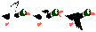
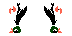

# DuckHunt

## [Live Demo](https://gradyzhu.github.io/duckhunt/)

## Overview

A remake of the popular 1984 shooter game DuckHunt.  The objective of the game is to shoot ducks and accrue as many points as possible.

Ducks appear one at a time and the player is granted 3 shots to shoot down the duck. The player must shoot 6+ ducks to advance to the next round.  Failure to do so will result in a game over.  With each subsequent round, ducks will increase in speed and be worth more points when shot.

## Technologies

* HTML5 Canvas 
* CSS
* Javascript (ES6)

## Features

### Collision Detection


Upon mousemove, the cross position is constantly being updated.

```javascript
// cross.js

window.addEventListener('mousemove', event => {
  var bounds = this.c.canvas.getBoundingClientRect();
  this.posX = event.clientX - bounds.left;
  this.posY = event.clientY - bounds.top;
  this.update();
});
```
Upon click, the current cross position is saved to click position variables.

```javascript
// cross.js

window.addEventListener('click', () => {
  if (this.hit || this.flyAway || !this.gameStart) return;
  if (this.shots.count > 0) this.shots.count--;
  this.clickPosX = this.posX;
  this.clickPosY = this.posY;
});
```
A collision is logged when the click position exists within the boundaries of the Duck sprite's dimensions within Canvas.

```javascript
// duck.js

collision() {
  if (
    this.cross.clickPosX > this.posX + 6 && 
    this.cross.clickPosX < this.posX + 58 &&
    this.cross.clickPosY > this.posY + 6 &&
    this.cross.clickPosY < this.posY + 58
  ) {
    return true;
  }
  return false;
}
```

### Sprite Animations

I quickly realized that determining the precise X and Y dimensions on a spritesheet with unique graphics would be an absurd task that would yield inprecise results.  Implementing pixel perfect sprite animations required a bit of finagling.  Using photoshop, I exported sprite animation's frames in separate .png files to make my life a little easier.  






Using RequestAnimationFrame, I call the Game's loop function and recursively render and update Canvas.

### Game Logic

The game creates instances of each game object and passes each the object the Canvas context, or `c`.  Upon Game `render()`, objects render in order of environment, round, scoreboard, and cross to ensure proper canvas layering.

```javascript
// game.js
  
render() {
  this.environment.render();

  if (this.start) {
    this.gameStartAni.render();
    this.isNewRound = true;
  }

  if (!this.start && !this.gameOver) {
    this.round.render();
    this.environment.render();
  }
    
  if (this.isNewRound) {
    this.roundScreen.render();
    if (this.roundScreen.aniFin) {
      this.isNewRound = false;
    }
  }

  this.scoreboard.render();
  
  if (this.gameOver) {this.gameOverScreen.render();}
  this.cross.render();
}
```
Gameover is triggered when there are fewer than 6 ducks hit per round and 10 ducks have spawned in a given round. 

```javascript
isGameOver() {
  let ducksHit = this.scoreboard.ducks.arr.filter(el => el === 1).length;
  if (ducksHit < 6 && this.round.waveCount === 10) {
    this.gameOver = true;
  } 
}
```
### Scoring System

With Ducks, Waves, and Rounds constantly being created and destroyed based on game logic, I required a way to store and update class agnostic variables over the duration of a single Game instance.  The Scoreboard class tracks the players point total, round count, ducks shot per round, and shots per wave.

```javascript
const Score = require("./score.js");
const Shots = require("./shots");
const Ducks = require("./ducks");

class Scoreboard {
  constructor(c) {
    this.c = c;
    this.roundCount = 1;
    this.score = new Score(this.c);
    this.shots = new Shots(this.c);
    this.ducks = new Ducks(this.c);
  }

  render() {
    this.score.render();
    this.shots.render();
    this.ducks.render();

    this.c.fillStyle = "black";
    this.c.fillRect(48,384,47,21.5);
    this.c.fillStyle = "#C5F652";
    this.c.font = "16px Pixel Emulator";
    this.c.fillText(`R=${this.roundCount}`, 89.5, 400);
  }

  renderPts(posX, posY) {
    this.c.textAlign = "center"; 
    this.c.fillStyle = "white";
    this.c.font = "12px Pixel Emulator";
    this.c.fillText(`${this.roundCount * 500}`, posX, posY);
  }

  update() {
    this.ducks.update();
  }
}

module.exports = Scoreboard;
```

### Flight Algorithm

I implemented a tick counter increments per `update()` call.

```javascript
// duck.js

updateDir() {
  this.dirCount++; 
  if (
    this.dirCount > this.dirCountMax &&
    this.direction !== "fall"
    ) {
      this.direction = this.changeDir();
      this.dirCount = 0;
  }
}
```

When the count exceeds the max count, the duck's direction randomizes based on the return value of `changeDir()`.

```javascript
// duck.js
  
changeDir() {
  let num = Math.random();
  if ( num < 0.1667 ) {
    this.duckImage.src = "images/fly_left.png";
    return "left";
  }
  if ( num > 0.1667 && num < 0.3333 ) {
    this.duckImage.src = "images/fly_right.png";
    return "right";
  }
  if ( num > 0.3333 && num < 0.50 ) {
    this.duckImage.src = "images/fly_top_left.png";
    return "top-left";
  }
  if ( num > 0.50 && num < 0.667 ) {
    this.duckImage.src = "images/fly_top_right.png";
    return "top-right";
  }
  if ( num > 0.667 && num < 0.833 ) {
    this.duckImage.src = "images/fly_top_left.png";
    return "bot-left";
  }
  if ( num > 0.833 && num < 1 ) {
    this.duckImage.src = "images/fly_top_right.png";
    return "bot-right";
  }
}
```

## Future Features

* Highscore board
* Game sounds / music
  * Mute button
* Game start button
* Restart button

